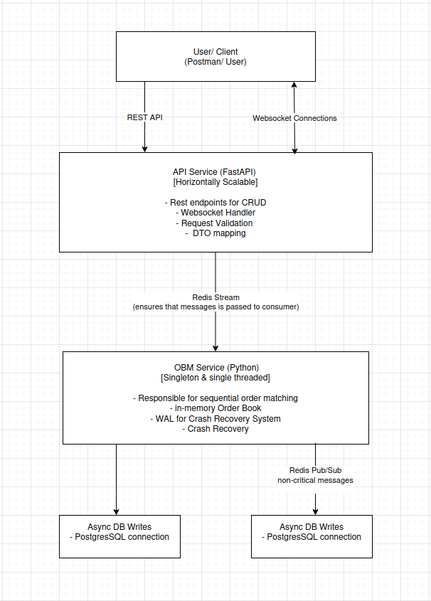

# Order API - AlgoTest Assessment POC

A microservices-based Order matching engine implementation built with Python FastAPI, Redis, Postgres and Docker

## Overview

This project implements a order book (limit-type) with real-time order matching, WebSocket updates as well as  crash recovery. The system is based on a microservices architecture with Redis-based communication and PostgresSQL for persistence.

### Architecture

```

```

## Architecture Documentation

See `docs/ED for Assessment POC.md` for detailed engineering design.

## Tech Stack

| Component | Technology |
|-----------|-----------|
| API Framework | FastAPI |
| Order Book | sortedcontainers.SortedDict + collections.deque |
| Message Queue | Redis Streams |
| Event Bus | Redis Pub/Sub |
| Database | PostgreSQL |
| Containerization | Docker + docker-compose |
| Language | Python 3.11+ |

## Quick Start

### Prerequisites

- Docker and Docker Compose installed
- Ports 8000 (API), 5432 (PostgreSQL), 6379 (Redis) available

### 1. Clone and Setup

```bash
gh repo clone akhil9281/AlgoTest-OrderApi
```

### 2. Start Services

```bash
# go inside the directory
cd AlgoTest-OrderApi/

# build and start all services
docker-compose up --build
```


### Stopping Services

```bash
# Stop all
docker-compose down

# Stop and remove volumes (WARNING: this will delete data)
docker-compose down -v
```


### 3. Verify Services

- **API Documentation**: http://localhost:8000/docs (Swagger UI)
- **Health Check**: http://localhost:8000/
- **Redis**: `redis-cli ping` or `docker exec -it orderapi-redis redis-cli`
- **PostgreSQL**: `docker exec -it orderapi-db psql -U postgres -d orderdb`

### 4. Test the API

- Navigate to http://localhost:8000/docs
- Try out the endpoints interactively


## API Endpoints

### Orders

| Method | Endpoint | Description |
|--------|----------|-------------|
| POST | `/orders` | Create new order |
| GET | `/orders` | Get all orders |
| GET | `/orders/{order_id}` | Get specific order |
| PUT | `/orders/{order_id}` | Modify order price |
| DELETE | `/orders/{order_id}` | Cancel order |

### Trades

| Method | Endpoint | Description |
|--------|----------|-------------|
| GET | `/trades` | Get all executed trades |

### WebSocket

| Endpoint | Description |
|----------|-------------|
| `localhost:8000/ws/trades` | Real-time trade updates |
| `localhost:8000/ws/orderbook` | Order book snapshots (every 1s) |


## Crash Recovery

- The OBM service uses a Write-Ahead Log (WAL) for crash recovery:

```bash
# Stop the OBM service
docker-compose stop obm

# Restart - it will replay the WAL and restore state
docker-compose start obm

# View logs to verify recovery
docker-compose logs -f obm
```

- Currently, we simply parse the whole WAL log to recover our data, but in production environment we should ideally store `lsn` value for the last transaction store in our system so we don't need to parse huge files on startup everytime.

## Development

### Running Locally (without Docker)

```bash
# Create virtual environment
python -m venv .venv
source .venv/bin/activate  

# Install dependencies (for each service)
cd src/api_service
pip install -r requirements.txt

cd ../obm_service
pip install -r requirements.txt

# need to start Redis and PostgreSQL separately
# update .env with local connection strings

# Run services
python -m api_service.main
python -m obm_service.main
```

## Design Decisions

### 1. Price Handling
- **External API**: Accepts/returns `float` (e.g., 123.45)
- **Internal**: Converts to `int` paise (e.g., 12345) to avoid floating-point precision errors

### 2. Order Matching
- **Priority**: Price first, then time (FIFO)
- **Trade Price**: Uses existing order book price, not incoming order price
- **Partial Fills**: Supported

### 3. Single OBM Instance
- Order matching must be sequential to maintain consistency, thus it is Single-Threaded in nature.
- API service can scale horizontally, OBM cannot

### 4. WAL-based Recovery
- Simple file-based append-only log
- Replayed on startup to restore state
- Appropriate for POC/MVP, in production environments we can use dedicated recovery tools or Postgres in-built WAL.

## Testing

Import the Postman collection from `ALGOTEST.postman_collection.json` to test all endpoints in Postman.


## Future Enhancements

- Multiple symbols/instruments support
- Advanced order types (stop-loss, iceberg, etc.)
- Rate limiting and authentication
- Metrics and monitoring (Prometheus/Grafana)
- Distributed WAL (Kafka-based)
- Multi-region deployment

## License

This is a proof-of-concept implementation for assessment purposes.
